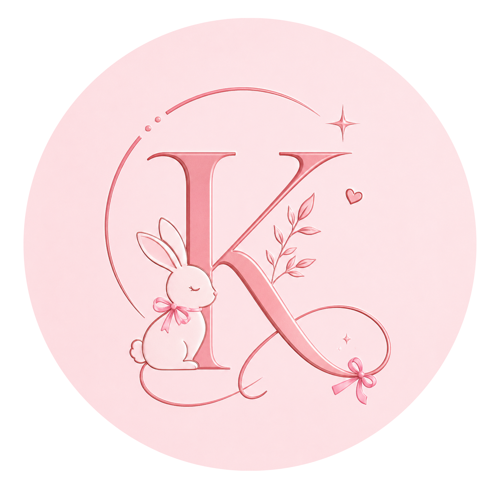
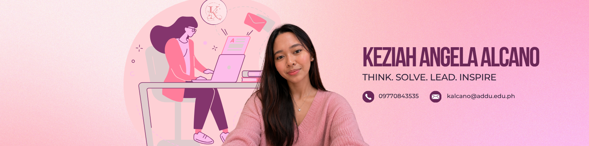
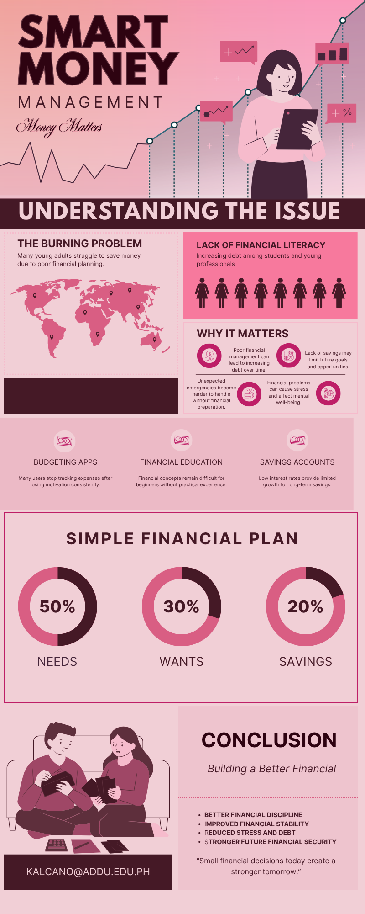

<div align="center">

# Keziah Angela Alcano
### Professional Design Portfolio

**_Think. Solve. Lead. Inspire._**

`Branding` · `Visual Design` · `Multimedia Production` · `Digital Tools`

</div>

---

## 👋 Welcome

Welcome to my professional design portfolio. This repository showcases the outputs and creative projects I developed throughout the **GE-IT Skills** course. Through branding, visual design, multimedia production, and digital tools, I explore how creativity and technology can work together to communicate ideas effectively and professionally.

---

## 🧭 Table of Contents

- [Professional Bio](#-professional-bio)
- [Portfolio Directory](#-portfolio-directory)
- [Branding Kit](#-branding-kit)
  - [Logo Design](#logo-design)
  - [Portfolio Header](#portfolio-header)
- [Documents & Infographics](#-documents--infographics)
- [Media Projects](#-media-projects)
  - [Video Introduction](#video-introduction)
- [Skills Demonstrated](#-skills-demonstrated)
- [Reflection Summary](#-reflection-summary)
- [Contact](#-contact)

---

## 🙋 Professional Bio

Hello! I am **Keziah Angela Alcano**, an aspiring business leader and creative problem-solver with interests in entrepreneurship, leadership, branding, communication, and digital design. I enjoy creating projects that combine creativity, strategy, and purpose to deliver meaningful and visually engaging experiences.

This portfolio serves as a collection of my **GE-IT Skills** outputs, highlighting my growth in visual communication, branding, multimedia creation, and the effective use of technology in presenting ideas.

| | |
|---|---|
| 🎓 **Course** | GE-IT Skills |
| 🎯 **Focus Areas** | Branding · Visual Design · Multimedia · Digital Tools |
| 🧠 **Approach** | Strategic, purpose-driven, audience-centered design |
| 🚀 **Personal Tagline** | Think. Solve. Lead. Inspire. |

---

## 📁 Portfolio Directory

This repository is organized into the following sections:

```
keziah-design-portfolio/
│
├── 📁 brandingkit/        # Brand identity materials, logo, and color palette
├── 📁 visualdesigns/      # Banners, promotional graphics, and visual communication outputs
├── 📁 documents/          # Infographics, reports, and design-related documents
├── 📁 media/              # Video projects, multimedia outputs, and presentation materials
└── 📁 prototype/          # Interactive prototypes and design concepts
```

| Folder | Contents |
|---|---|
| **`/brandingkit`** | Brand identity materials, logo, and color palette |
| **`/visualdesigns`** | Banners, promotional graphics, and visual communication outputs |
| **`/documents`** | Infographics, reports, and design-related documents |
| **`/media`** | Video projects, multimedia outputs, and presentation materials |
| **`/prototype`** | Interactive prototypes and design concepts |

---

## 🎨 Branding Kit
*Located in `/brandingkit`*

### Logo Design

**Reflection**
My logo represents my personal brand and values. I designed it to reflect creativity, leadership, and purpose while maintaining a clean and professional appearance. Through its simple yet meaningful design, the logo serves as a visual representation of my commitment to thinking critically, solving problems, leading with confidence, and inspiring others.

> **Design intent:** *Clean · Professional · Purpose-driven*

---

### Portfolio Header

**Reflection**
The portfolio header was created to establish a strong first impression and communicate my personal identity as a designer and aspiring entrepreneur. I focused on balancing visual appeal and readability by combining thoughtful typography, layout, and branding elements that align with my overall design style.

> **Design intent:** *Strong first impression · Readable · On-brand*

---

## 📄 Documents & Infographics
*Located in `/documents`*

### Infographic and Written Outputs

**Reflection**

The documents and infographics in this section demonstrate my ability to organize information and present it in a clear, structured, and visually appealing format. I focused on simplifying complex ideas through effective use of visuals, typography, and content arrangement to improve readability and audience understanding.

> **Design intent:** *Clarity · Structure · Visual hierarchy*

---

## 🎬 Media Projects
*Located in `/media`*

### Video Introduction

**🔗 Link:** [Prototype](media/Alcano_ Prototyping.docx)

**Reflection**

For my video introduction, I focused on storytelling and self-expression by combining visuals, transitions, and narration into a cohesive presentation. This project allowed me to explore multimedia design while developing my confidence in presenting personal and professional information creatively.

> **Design intent:** *Storytelling · Self-expression · Cohesive presentation*

---

## 🛠 Skills Demonstrated

`Brand Identity Design` `Logo Design` `Typography` `Layout & Composition` `Infographic Design` `Information Architecture` `Video Editing` `Storytelling` `Presentation Design` `Digital Tools Proficiency`

---

## 📝 Reflection Summary

Across every section of this portfolio, four consistent threads tie the work together — drawn directly from my personal tagline:

| Principle | How It Shows Up in My Work |
|---|---|
| **Think** | Strategic decisions behind every layout, color, and message |
| **Solve** | Designs that simplify complexity and solve real communication problems |
| **Lead** | Confident visual choices that give each project direction and identity |
| **Inspire** | Outputs crafted to leave an impression and motivate the audience |

---

## 📬 Contact

I'm always open to feedback, collaboration, and new opportunities to design with purpose.

| | |
|---|---|
| 📧 **Email** | *[Add your email here]* |
| 💼 **LinkedIn** | *[Add your LinkedIn here]* |
| 🌐 **Portfolio Site** | *[Add your site/link here]* |

---

<div align="center">

*"Designing with intention — one project at a time."*

<sub>© Keziah Angela Alcano — Think. Solve. Lead. Inspire.</sub>

</div>

